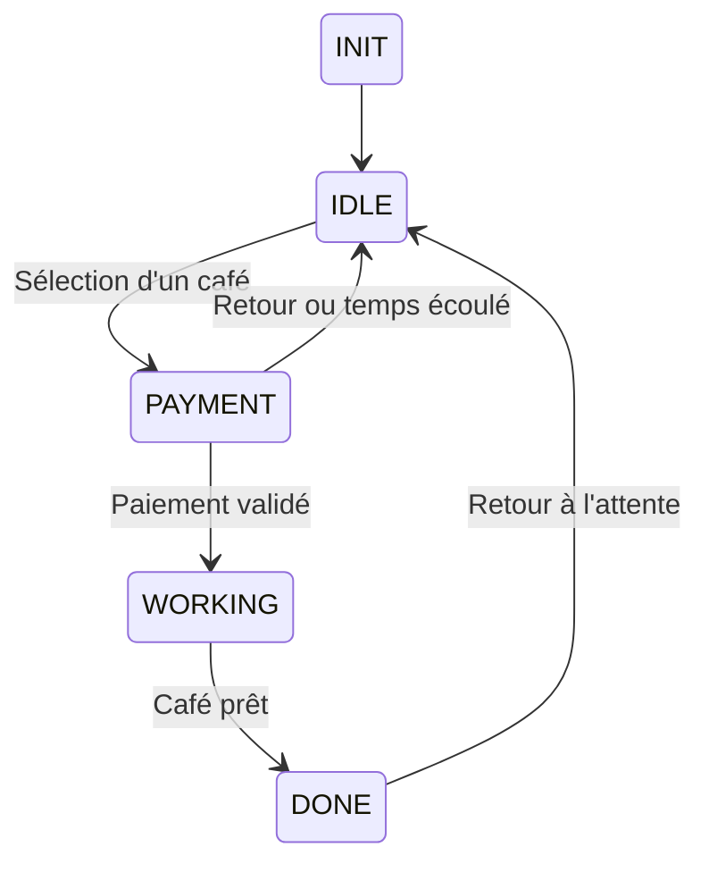

# ☕ Machine à café - TYKAWA


Ce projet est un **POC d’une machine à café** implémentée sur une **carte STM32 Nucléo-G431**.  

L’objectif est de simuler le fonctionnement principal d’une machine à café en utilisant un microcontrôleur : gestion des entrées utilisateur, machine d’états, et contrôle d’actionneurs simulés (pompe, écran, servomoteur,...).

## 📌 Fonctionnalités

- Interface utilisateur via **écran tactile TFT ILI9341**
- Simulation du **cycle de préparation du café**
- Implémentation d’une **machine à états**
- Gestion du temps via **timers du microcontrôleur**
- Organisation du code en **modules C**

Exemple de déroulement :

1. L’utilisateur sélectionne un type de café
2. _La machine chauffe l’eau_
3. Le servomoteur laisse passer une dose de café soluble
4. La pompe s’active
5. Le café est servi
6. La machine revient à l’état d’attente

# 🧰 Matériel

| Composant | Description |
|-----------|-------------|
| **STM32 Nucleo-G431** | Carte de développement principale |
| **TFT ILI9341** | Écran tactile pour l’interface utilisateur |
| **Pompe à eau** | Simulation du flux d’eau |
| **Servomoteur à butée** | Distribution du café soluble |

### Périphériques optionnels

- Résistance chauffante *(simulée)*
- Communication série **UART** pour le debug

# 🧑‍💻 Logiciel

| Élément | Technologie |
|--------|-------------|
| Langage | **C** |
| IDE | **STM32CubeIDE** |
| Framework | **STM32 HAL** |
| Documentation | **Doxygen** |

Le projet utilise la **HAL (Hardware Abstraction Layer)** fournie par **STMicroelectronics** afin de simplifier la configuration et l’utilisation des périphériques du microcontrôleur.

## 📁 Structure du projet
```
tykawa/
│
├── core/
│ └── Inc/
│   ├── stm32g4xx_hal_conf.h
│   └── stm32g4xx_it.h
│
├── app/
│ ├── config.h
│ ├── main.c # Point d'entrée
│ ├── screen.c # Gestion de l'écran TFT
│ ├── screen.h
│ ├── servo.c # Gestion du servomoteur
│ └── servo.h
│
├── drivers/
│ ├── bsp/
│ ├── cmsis
│ └── stm32g4xx_hal/
│
├── html/
│ └── index.html # Documentation Doxygen
|
└── README.md
```

# ⚙️ Architecture du système

Le firmware est organisé autour d’une **machine à états** représentant les différentes phases de fonctionnement de la machine à café.

## Diagramme d'états



### États principaux

| État        | Description                            |
| ----------- | -------------------------------------- |
| **INIT**    | Initialisation des différents éléments |
| **IDLE**    | En attente de la sélection d'un café   |
| **PAYMENT** | En attente du paiement (retour auto apres ~1s) |
| **WORKING** | Préparation du café                    |
| **DONE**    | Café prêt, écran de fin (~1s)          |

Chaque état contrôle les périphériques nécessaires et déclenche des transitions en fonction du temps ou des entrées utilisateur.

## 🔌 Périphériques utilisés

| Périphérique | Rôle |
|---------------|------|
| TFT ILI9341 | Interface utilisateur |
| Servomoteur, Electrovanne | Préparation du café | 
| Timer | Simulation du temps de préparation |
| UART (optionnel) | Messages de debug |

## 🚀 Compilation et exécution

1. **Cloner le dépôt**
   - ```git clone https://github.com/yourusername/coffee-machine-stm32.git```
2. **Ouvrir le projet**
   - Importer le projet dans STM32CubeIDE.
3. **Compiler**
   - Build du projet via l’IDE.
4. **Flasher la carte**
   - Programmer la STM32 Nucleo-G431 via ST-Link.
5. **Tester**
   - Utiliser l’écran tactile pour sélectionner un café et lancer la simulation.

## 🧪 Objectif pédagogique

Ce projet illustre plusieurs concepts importants des systèmes embarqués :

- Machines à états finis
- Abstraction matérielle avec HAL
- Gestion du temps dans un système embarqué
- Architecture logicielle modulaire
- Configuration des périphériques STM32

## 📚 Documentation
La documentation générée avec Doxygen est disponible dans :
```
/html/index.html
```
